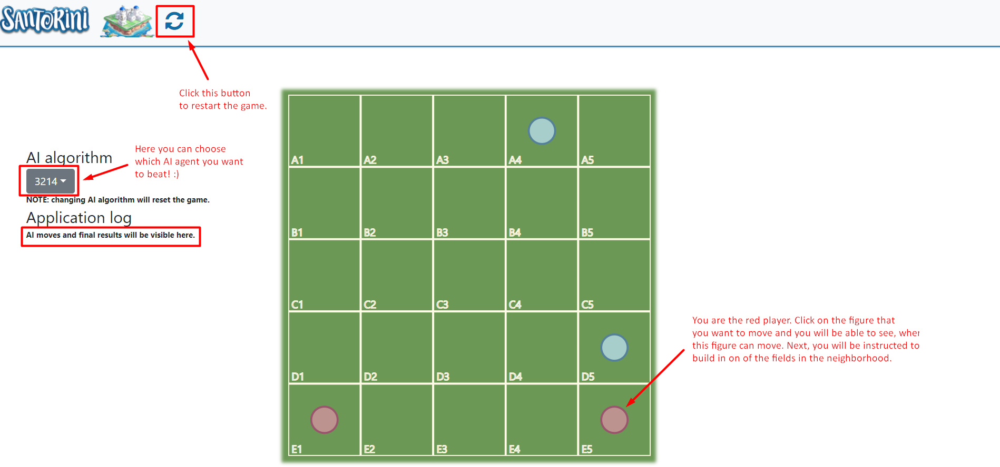

# Santorini AI

## About this repository ##

This is the repository used for a project in Artificial Intelligence course at UL-FRI.
We developed a graphical interface and heuristics-based multi-agent systems that are able to play the Santorini board game.

## Folder structure
* `/Game` folder, where all the game logic is saved, 
* `/WebAPI` folder, where we saved the API used for communication with graphical interface.
* `/UI` folder, where the user interface is with all the styling and scrypting.


## Folder structure


## Environment setup
To setup the environment for this project, follow these instructions:

1. Install [Python version 3.8 or higher](https://www.python.org/downloads/) and [Anaconda](https://www.anaconda.com/products/individual).
2. Assuming you have `git` already installed, clone this repository to the desired destination:
    ```shell script
    $ git clone https://github.com/lzontar/Santorini-AI
    ```
3. Move to the folder, where you cloned this repository and import the environment from the config file `requirements.txt` via:
    ```shell script
    $ pip install -r requirements.txt
    ```
4. Your enviroment is ready to go!

### Wanna play in our fancy user interface?
1. Move to the API folder and run the server: 
    ```shell script
    $ cd WebAPI
    $ python manage.py runserver
    ```
2. Simply run the HTML file:
    ```shell script
   $ ../UI/Santorini-Boardgame.html
    ```
3. See instructions in the image below. Good luck! :star_struck: :100:

 
Alternatively, you can run the play() method in santo.py to use the terminal UI.